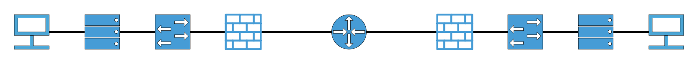

<p align="center">
  
</p>

# wnetgraph
wnetgraph is a jgraph based, command line utility to create visual diagrams of network devices based on their hierarchy within the network, by creating a graph representation from a descriptor file and using a series of graph algorithms for spatial organization.

## Compilation and Use (For the TAs)
A makefile is provided. The makefile in the repo assumes you are using gcc as your C compiler, and that you are running on one of UT's Hydra/Tesla machines. If either assumption is wrong, you will need to change your compiler in the makefile, or change the variable `JGRAPH_LOCAL` within the makefile to the path to your local jgraph installation. Additionally, the makefile assumes `convert` is installed from imagemagick.

Calling `make examples` will make all necessary calls to create 5 pre-created example diagrams from the specification `.txt` files in `./examples/`. These diagrams can be found in `.pdf` files in the created `./output/` directory.

`make clean` will perform the usual make clean function, along with removing all the output the examples may have created.

### Syntax
A network of devices is specified in a `.txt` file using the syntax as described below:

A new device is added to the network description file by providing a hostname. The hostname can contain any alphanumeric characters, including spaces, however, this hostname *must* be unique within the specification file. After specifying a hostname, there are 5 different options you may specify for each unique device. You may specify none of these, some, or all. Each specification option must be provided on a new line (whitespace is ignored aside from the newline character). 

After providing all specifications for a device that you intend to, you *must* provide the key word `end` on a new line. Writing `end` will then enable you to provide a new hostname for adding another device to a network. Once all intended devices and configurations have been provided, you *must* provide the key word `done` on a new line. The `done` keyword signifies the end of the specification file, at which time the program will proceed with creating the .jgr file for the network's representation.

An additional semantic: every network specification file must provide exactly one device of `type gateway`. This is symbolic of the default gateway for a network, and functions as a root node for the rest of the network.

#### Specification Options
1. `hostname`
  - Note: changing the hostname of the network device will change 
2. `type`
  - `type` must be followed by one of the following arguments:
    - `gateway`
    - `router`
    - `firewall`
    - `switch`
    - `server`
    - `host`
3. `uplink`
  - `uplink` must be followed by a space, and a valid hostname for a device
4. `peer`
  - `peer` must be followed by a space, and a valid hostname for a device
5. `host`
  - `host` must be followed by a space, and a valid hostname for a device

An example:
```
Router0
  type gateway
  host Switch1
  host Switch2
end

Switch1
  type switch
  peer Switch2
  host PC1
end

Switch2
  type switch
end
done
```

Note that PC1 is not given any specifications in the above network description. This is acceptable, and PC1 will be implicly created by the program.

Device specifications do not need to be provided all at one time. For example, the following is acceptable:
```
Router0
  type gateway
end

Switch1
  type switch
  uplink Router0
end

Router0
  host Switch2
end
done
```

#### Symbols
The project currently supports 5 different 2 dimensional device symbolic representations. These are selected by providing a `type` specification for each device. If no type is specified, the symbol for a client is used by default.
- Client machines
- Servers
- Switches
- Routers
- Firewalls

### Organization
Spatial organization of the resulting diagram is accomplished by hierarchically organizing the devices in the network based on their maximum depth from the gateway device. For example, if a PC is connected to a switch, and the switch is connected to the gateway, the gateway will be positioned at the top of the diagram, followed next by the switch, then at the bottom of the diagram will be the PC.

To organize the image horizontally, the program starts at the middle of the image, then progressively moves outward in both directions from the y-axis. Currently, there is room for improvement in this process. As the number of hosts connected to a device increase, the hosts are not guaranteed to be grouped neatly together with their parent device, and some messy lines *can* occur as a result. However, I have guaranteed that two images will *never* overlap eachother. So while things can get messy with complex networks, there is no fear of one device occluding another.

A good instance of this area for improvement is in example 3.